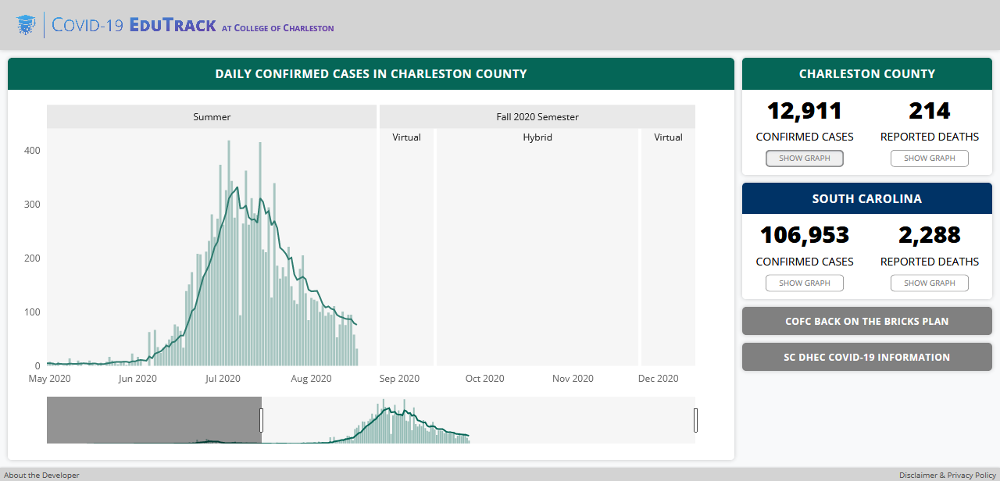

# COVID-19 EduTrack for College of Charleston
This repo contains the code to collect, process, and display graphs of COVID-19 data for the College of Charleston area. This dashboard can be viewed live at this link: https://cofccovidtracker.herokuapp.com/

Colleges face difficult decisions in their procedures during the Fall 2020 semester, including the College of Charleston (CofC). This dashboard shows graphs of the number of confirmed cases and reported deaths due to COVID-19 in geography relevant to CofC. The graphs also show the lengths of time that CofC plans to hold fully virtual or hybrid classroom instruction. Below is a screenshot of the dashboard from August 18, 2020.

## Data Sources
The dashboard uses the latest data from the <a href="https://github.com/CSSEGISandData/COVID-19">JHU CSSE COVID-19 GitHub repo</a>. Their dataset provides daily numbers of COVID-19 cases and deaths at the county level. The dashbaord also used ZIP code level data from the <a href="https://scdhec-covid-19-open-data-sc-dhec.hub.arcgis.com/">South Carolina Department of Health and Environmental Control's ArcGIS Open Data</a>

Disclaimer: The developer of this webpage is not liable nor responsible for the accuracy of this data, nor any decisions made based on the presentation of this data. Please navigate to the live webpage <a href="https://cofccovidtracker.herokuapp.com/">here</a> and click "Disclaimer and Privacy Policy" in the bottom right corner for additional details.
## Overview of Methodology by File
`app.py`: This is the main Python file, which is executed when the webpage is requested. This file is responsible for plotting the data on graphs and creating the HTML layout for the page.

`covid_data.py`: Contains several classes for collecting and manipulating the COVID-19 data.

`color.py`: A class to store and format strings for RGBA colors.

`assets/intervals.csv`: A table containing the start and end dates for the semesters and the different class modes (“in-person”, “hybrid”, “virtual”), which is plotted in the background of the graph.

`assets/script.js`: Contains event listeners to scroll the page on mobile devices when the user clicks one of the “Show Graph” buttons.

`assets/analytics.js`: Google Analytics script

`assets/style.css`: Styles the HTML elements laid out in `app.py`
## Highlights of Methodology
<b>Object-Oriented Data Processing</b>: I initially had all the data processing (using pandas) in the `app.py` file. I realized that if this app were to scale up and need to handle more data, the code would be cleaner if I created a new file to handle the data processing in an object-oriented manner. `JHUDataset` is a class that is responsible for bringing in the data from the JHU CSSE COVID-19 GitHub repo and formatting the data for use in the dashboard. `SCDHECOpenDataset` is another class that brings in  data from the South Carolina Department of Health and Environmental Control. The subclasses (`StateData`, `CountyData`, etc.) take the pandas dataframe from `JHUDataset` and `SCDHECOpenDataset`, filtering the data down to the specified state, county, etc. The methods in classes like `StateData` and `CountyData` then return specific data, such as the total number of cases or a pandas series containing the number of new cases each day for that state or county. Overall, making the data processing an object-oriented structure cleans up the code in `app.py` and makes it more organized and readable.

<b>Objects for Colors</b>: The `color.py` file contains a fairly simple class which holds a color’s red, blue, and green, and alpha channels. The same colors come up over and over again in the user interface, so creating an object for each color and using it throughout makes the code more consistent. The `color_to_str()` method returns a string representation of the RGBA color, which Dash can read and use in the graphs and HTML layout.

<b>Graphs Denoting Time Periods in Graph Background</b>: The reason this dashboard is particularly useful to the College of Charleston is that the semesters and time periods of different learning modes are displayed as part of the background of the graph. Users get a sense for the trends of COVID-19 data in Charleston County and South Carolina relative to the College’s schedule for online vs. in-person classes.
## Accessing this Project
The live dashboard can be viewed <a href="https://cofccovidtracker.herokuapp.com/">here</a>.

Users are also welcome to fork this repo and work with the code and data themselves. The `requirements.txt` file lists the needed libraries to create a Python environment to run this code. This project is under an MIT license.
## Contact the Developer
This project was created during summer 2020 by Connor Cozad, an undergraduate student in data science at the College of Charleston. Feel free to reach out to me by email at 23ccozad@gmail.com.
